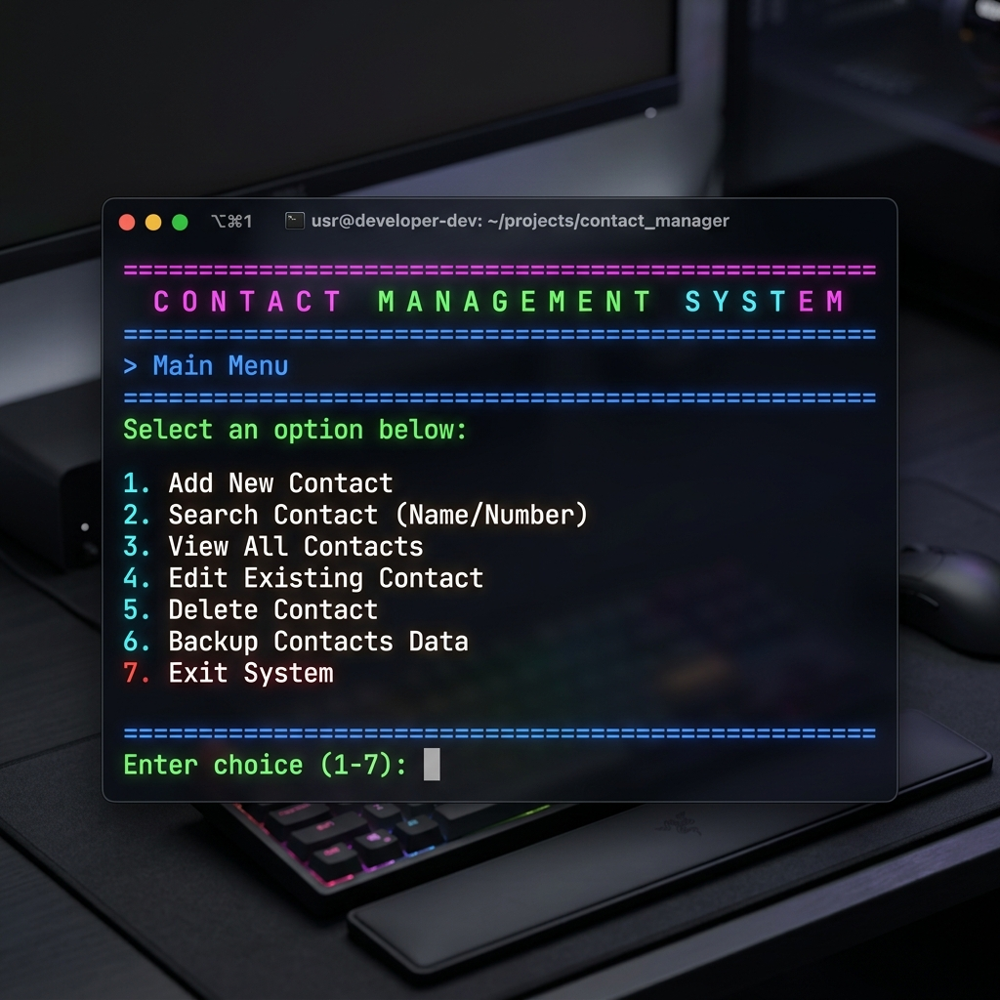

# Contact Management System

## Project Description
A comprehensive contact management system built with Python using dictionaries and functions. This system allows users to manage their contacts with full CRUD operations, search functionality, and data persistence.

## What I Learned
1. **Functions**: Creating reusable, organized code blocks
2. **Dictionaries**: Storing and retrieving data using key-value pairs
3. **String Methods**: Advanced text manipulation and formatting
4. **File Operations**: Saving and loading data from JSON files
5. **Input Validation**: Ensuring data quality and preventing errors
6. **Error Handling**: Gracefully handling unexpected situations

## Features
- ✅ Add new contacts with validation
- ✅ Search contacts by name (partial matching supported)
- ✅ Search contacts by phone number
- ✅ Update existing contact information
- ✅ Delete contacts with confirmation
- ✅ View all contacts in formatted display
- ✅ Categorize contacts (e.g., Family, Work, Friend)
- ✅ List contacts filtered by category
- ✅ Save contacts to JSON file automatically
- ✅ Load contacts from file on startup
- ✅ Export contacts to CSV format
- ✅ Contact statistics and analytics
- ✅ Phone number and email validation
- ✅ User-friendly menu interface
- ✅ Error handling for all operations

## How to Run
```bash
# Navigate to project folder
cd week3-contact-manager

# Install any requirements
pip install -r requirements.txt  # (if needed)

# Run the program
python contacts_manager.py

# Run tests
python test_contacts.py
```

## Data Structure
```python
contacts = {
    "John Doe": {
        "phone": "1234567890",
        "email": "john@example.com",
        "address": "123 Main St",
        "category": "Friends"
    },
    "Jane Smith": {
        "phone": "0987654321",
        "email": "jane@example.com",
        "address": "456 Oak Ave",
        "category": "Work"
    }
}
```

## Sample Menu
```text
========================================
       CONTACT MANAGEMENT SYSTEM       
========================================
1.  Add New Contact
2.  Search Contact (by Name)
3.  Search Contact (by Phone)
4.  Update Contact
5.  Delete Contact
6.  Categorize Contact
7.  List Contacts by Category
8.  Display All Contacts
9.  View Statistics
10. Save & Backup
11. Exit
========================================
Enter your choice (1-11):
```

## Sample Output
```text
[Search Contact by Name]
Enter name to search: john

--- Search Results (1 found) ---

[1] John Doe (Friends)
    Phone:   1234567890
    Email:   john@example.com
    Address: 123 Main St

[View Statistics]
Total Contacts:         2
Contacts with Email:    2
Contacts without Email: 0
```

## Challenges & Solutions
**Challenge**: Handling duplicate contact names
**Solution**: Added checks before inserting into the dictionary to raise a `ValueError` if the contact already exists, ensuring no accidental overwrites.

**Challenge**: Phone number validation across different formats
**Solution**: Created a strict validation function that ensures exactly 10 digits are provided, rejecting alphabetic characters or short strings.

**Challenge**: Efficient search with partial matching
**Solution**: Used dictionary iteration combined with `.lower()` for robust case-insensitive partial string matching.

**Challenge**: Data persistence with JSON
**Solution**: Used the `json` module with `try-except` blocks to handle file operations smoothly, automatically creating the file if it doesn't exist and auto-saving on application exit.

**Challenge**: Managing unexpected user termination
**Solution**: Wrapped the main application loop in a `KeyboardInterrupt` exception handler so that if a user hits Ctrl+C, the application safely auto-saves their data before closing.

## Code Structure
- **`contacts_manager.py`**: The main executable script containing all logic.
- **`contacts_data.json`**: The persistent storage file containing dictionary data.
- **`test_contacts.py`**: Unit testing file using Python's `unittest` framework to guarantee validation accuracy.

## Visual Documentation

*(Note: A screenshot of the terminal interface running the application)*

## Testing Evidence
Run `python test_contacts.py` to view unit tests passing. The tests cover `validate_name`, `validate_phone`, and `validate_email` with assertions checking for empty strings, incorrect lengths, and malformed email addresses. All boundary cases gracefully fail as expected.
